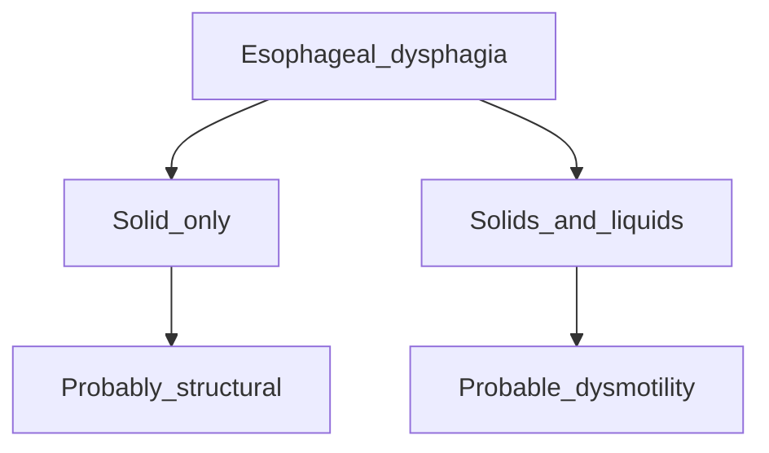

# DYSPHAGIA
Oropharyngeal: inability to propel food from mouth through UES into esophagus

Esophageal: difficulty swallowing & passing food from esophagus into stomach

```mermaid
flowchart TD
	Esophageal_dysphagia --> Solid_only
	Esophageal_dysphagia --> Solids_and_liquids
	Solid_only --> Probably_structural
	Solids_and_liquids --> Probable_dysmotility
```

